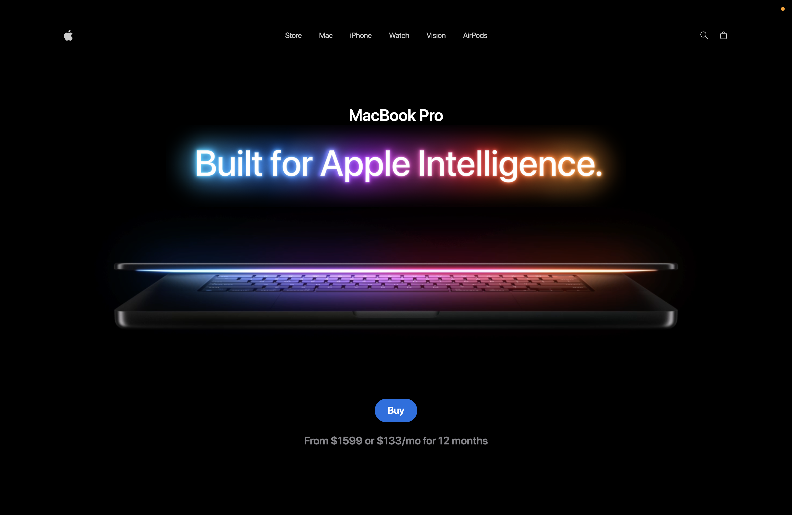

# 3D MacBook Landing Page



A modern and interactive 3D MacBook landing page built with React, Vite, Tailwind CSS, GSAP, and Three.js. The project features smooth animations, responsive design, and immersive 3D visuals inspired by Apple's product pages.

## Features

- Interactive 3D MacBook model
- Smooth GSAP animations
- Responsive design
- Modern UI/UX
- Fast development with Vite

## Tech Stack

- React
- Vite
- Tailwind CSS
- Three.js
- GSAP

## Installation

```bash
npm install
npm run dev
```

## Build

```bash
npm run build
```

## Preview

```bash
npm run preview
```

## Author

Rutuja Darade
